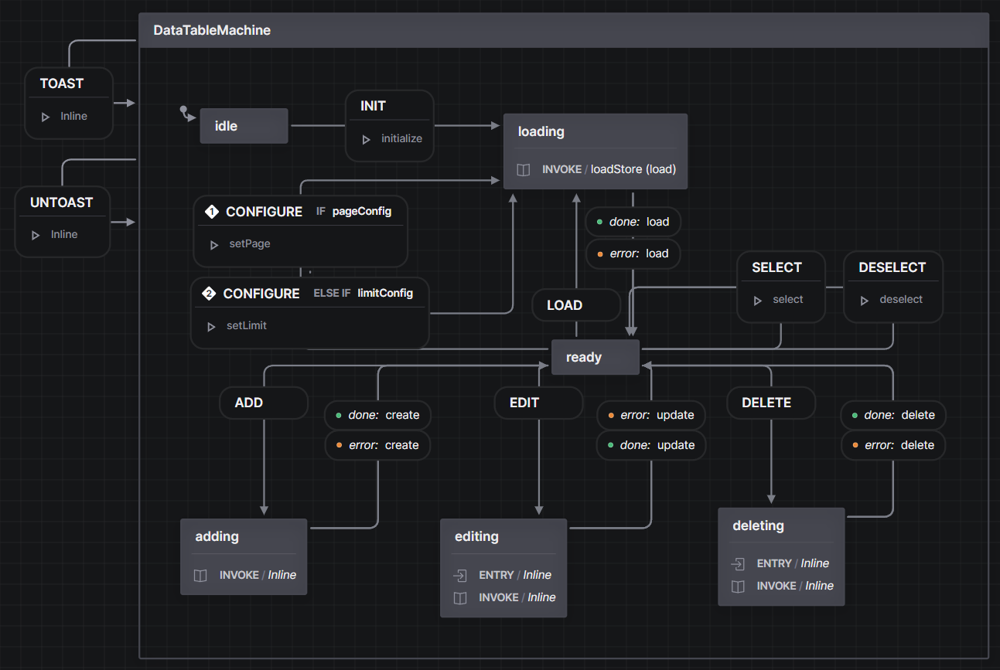

# vue-xstate-example

This is a simple rest application using Vue 3, Vuetify 3, XState 4 and Pinia.

This app was created to explore how to structure Vue applications using XState.
Specifically is the use of XState and Pinia an either/or decision, or can they be used together?
If so, how do they best interact?

The result is an application that uses Pinia to manage the quantitative state, in this case the API
data, while XState handles the qualitative state, in this case the UI state.  The Pinia store is the
single source of truth for data returned by the server.  The component states are defined by XState
machines.  The XState machines receive events from UI components and call actions in my Pinia store
when applicable.  In this way, XState can be seen as an intermediary between the Vue components and the
Pinia data store.

Another consideration is how to tie the state machines to the components.  Is it best implemented with
one state machine that manages all components, or does each component have its own machine? How would
multiple machines communicate with each other?  Does the component create the machine, or does the machine
activate the component?

I arrived at a solution with one "main" machine tied to the main data table.  This machine is able
to invoke acions on the pinia store for operations like loading the data that do not involve other
subcomponents.  For operations that involve other subcomponents such as adding and editing, the main
machine invokes other state machines which manage the state of those subcompnents and can also
invoke actions on the pinia store.

This solution is working, but it may be able to be improved upon.  The issue is whether I should invoke
the child machines from the main machine, or if I should make them available as actors through a service
hook.  If these children machines were available through a service hook, they would be accessible to any machines
or components.  On the other hand, I do like the current structure where children machines are invoked when
needed, reach a final stage when their work is done and hand control back to the main machine.  TODO: explore this further.


## XState Machines
* note: Screenshot taken from the XState VSCode extenson which allows one to simulate the machines.  You can step through the operation of any of these machines by bringing them up in VSCode with the XState extension and clikcking the `Open Visual Editor` link above the machine definition

### DataTableMachine
This could be considered the application's "Main" machine.  It handles the loading of the Data table,
paging, selection and all API operations.

For API operations that do not use an additional Vue subcomponent, such as Loading, the DataTableMachine
invokes actions in the Pinia store which return promises.  For API operations that introduce a new
subcomponent, such as Deleting (delete confirmation dialog) or creating/editing (form dialog component),
the DataTableMachine invokes machines (CreateMachine, UpdateMachine, DeleteMachine) which control the
state of their subcomponents and invoke the Pinia store actions.



### CreateMachine
The CreateMachine is invoked when the DataTableMachine transitions to the "adding" state.  The
CreateMachine manages the state of the Postform component.  It validates the form when submitted,
invokes the create method of the pinia store, and enters a done state upon success.

### UpdateMachine
The UpdateMachine is invoked when the DataTableMachine transitions to the "editing" state.  The
UpdateMachine manages the state of the Postform component.  It loads the form, validates the form
when submitted, invokes the update method of the pinia store, and enters a done state upon success.

### DeleteMachine
The DeleteMachine is invoked when the DataTableMachine transitions to the "deleting" state.  The
UpdateDeleteMachineMachine manages the state of the DeleteConfirmation component.  Upon confirmation,
it invokes the destroy method of the pinia store, and enters a done state upon success.

### ToastMachine
A simple machine that controls toast messages shown to the user.  It is using the Vuetify Snackbar component
which is not optimal for this as it doesn't implement any stacking for multiple messages.  This is fine for
this demo, but I'd want to implement something more advanced in an actual production application.

This machine is exposed as an actor using a service hook.  The DataTable Machine uses the service hook to
obtain reference to this actor.  The DataTable Machine is then able to forward events to the ToastMachine,
which it is configured to do regardless fo the current state of the DataTable Machine.

# default (readme boilerplate)


### Project setup

```
# yarn
yarn

# npm
npm install

# pnpm
pnpm install
```

#### Compiles and hot-reloads for development

```
# yarn
yarn dev

# npm
npm run dev

# pnpm
pnpm dev
```

#### Compiles and minifies for production

```
# yarn
yarn build

# npm
npm run build

# pnpm
pnpm build
```

#### Customize configuration

See [Configuration Reference](https://vitejs.dev/config/).
